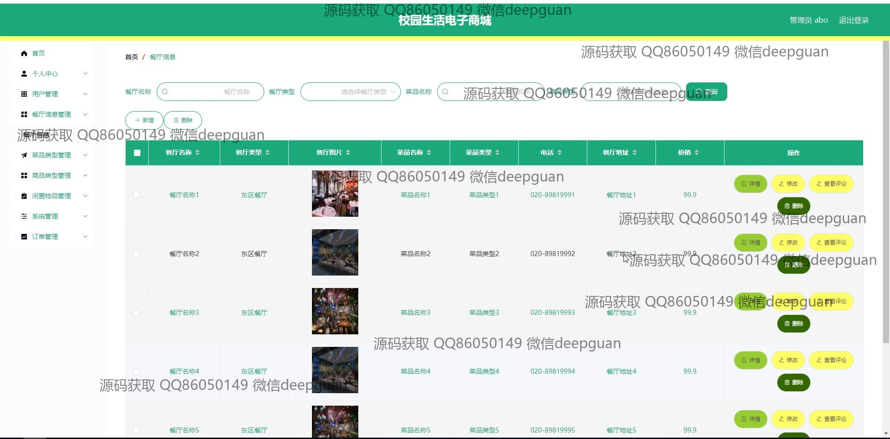
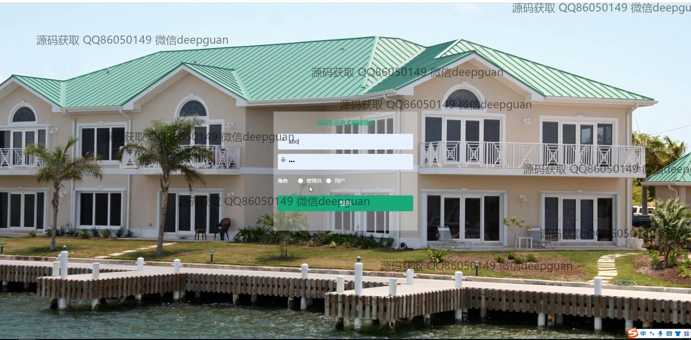
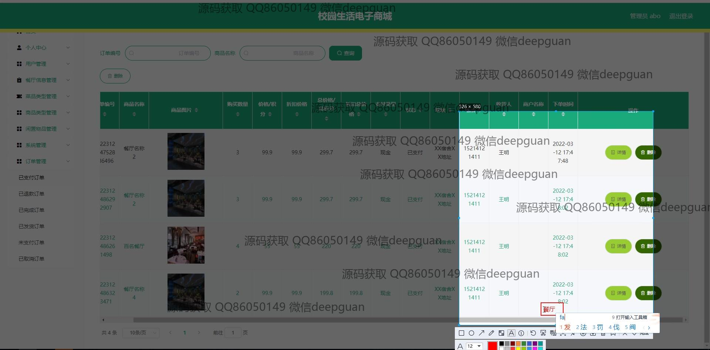

<h1 align="center">校园生活电子商城</h1>

## 简介
校园生活电子商城：角色分为管理员、用户；包括个人中心、用户管理、商品与订单管理、购物车、公告信息、餐厅信息、闲置物品展示功能，支持商品编辑、搜索和轮播图管理。    --计算机毕业设计源码；毕设源码；java毕业设计源码

## 联系方式

<h3 align="center">获取完整代码与数据库文件 + 微信：deepguan QQ: 86050149 QQ群: 783742310</h3>

<h3 align="center">可帮忙远程部署 包运行成功！提供远程部署、修改代码、设计文档指导、代码讲解等服务！</h3>

## 功能介绍（完整见运行截图）
管理员：基本功能包括登录、注册和退出操作。系统支持后台管理功能，管理员可以通过左侧导航栏访问各模块进行管理，如用户管理、菜品类型管理、商品管理、订单管理、餐厅信息管理等。可以对商品、菜品和餐厅信息进行添加、编辑、更新和删除操作，具备轮播图管理功能和商品查询功能。管理员还可以管理用户个人信息和地址，查看和处理订单，确保平台信息的及时更新与准确性。

用户：基本功能包括登录、注册和退出操作。用户可以浏览网站首页，通过主导航栏访问首页、餐厅信息、闲置物品、公告信息、个人中心等模块。在商品模块，用户可以查看商品列表、进行商品搜索和查看商品详情。购物车功能支持用户增删商品、查看购物车详情和进行结算。用户个人中心支持查看和修改个人信息，查询订单，管理地址和收藏，从而提升购物体验和管理方便性。

## 运行截图

本代码来源于网络,仅供学习参考使用!

